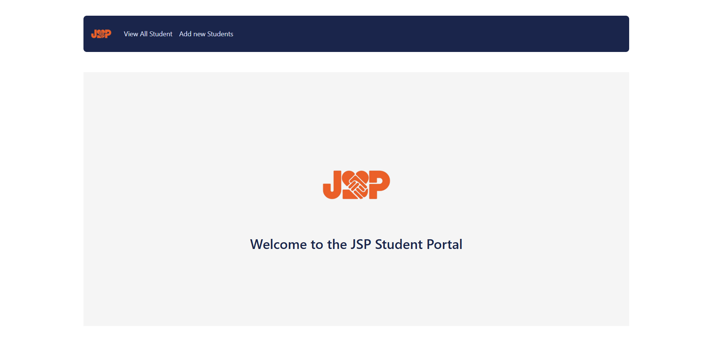
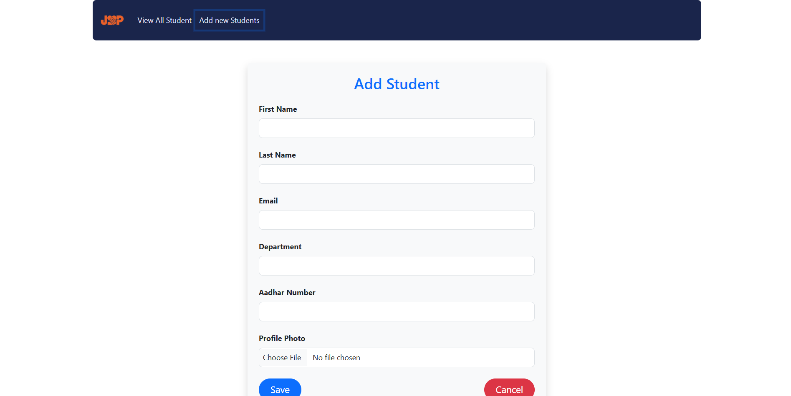

# Hi, I'm Siva 👋


#  Student Portal Application 🌟

- This application will be used as a  __Student Management System__ that connects students with various educational resources, course enrollments, and student tracking.

<br>


#  Technologies 🛠️

## 🖥️ Frontend:


**IDE:**  
  


- Technologies: **HTML, CSS, JavaScript, ReactJs** <br>
- IDE: **VS Code** 

---

## 🖥️ Backend:


**IDE:**  


- Technologies: **Java, Spring Boot** <br>
- IDE: **Eclipse**  

---

## 🗄️ Database:


**IDE:** 


- Technology: **MySQL** <br>
- Tool: **MySQL Workbench**  

---

## 🛠️ APIS Testing Tool

For testing the APIs, we are using Postman.

**IDE:**  


---

## 🔹 Description
- Student Portal is a smart Student management system that integrates frontend, backend, and database technologies to provide seamless automation and control.

## 🔹 Features
- User-friendly frontend interface
- Secure backend 🛠️ API with Spring Boot
- MySQL database integration

<br>

# Features 🚀

## 🔹Student Portal

- **User Registration :**   
  - Students can register in securely.

- **Profile Management:**    
  - We can see and manage their details. 

- **Students Search:**    
  - Based on the Student register emails we can find the Students.  

<br>

# Installation 🔧

## Frontend Setup

### 1. Clone the repository:

- git clone https://github.com/Siva611/SpringBootCRUD-UI <br>
- cd SpringBootCRUDUi

### 2. Install dependencies and run the frontend:

- npm install

- npm start

<br>

## Backend Setup

### 1. Clone the backend repository:

- git clone https://github.com/Siva611/SpringBootCRUD-BE <br>
- cd SpringBootCRUD-BE

## 🔹 Database Configuration  

To configure the Update the MySQL database in **Spring Boot**, add the following properties in `application.properties`:  

```properties
    spring.datasource.url=jdbc:mysql://localhost:3306/your_database_name
    spring.datasource.username=your_username
    spring.datasource.password=your_password
```


### Note: 
- Change the database name (__*your_database_name*__) if needed.
Ensure MySQL is running and the database is created.


### 3. Build and run the backend:

- mvn clean install <br>
- mvn spring-boot:run

 <br>

#  To see the Website View ✅



<br>


